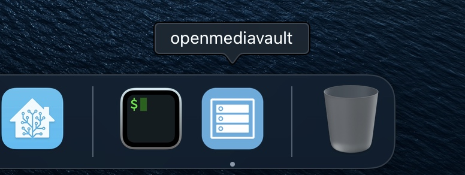

# openmediavault for MacOS X

Build a native MacOS X app for [openmediavault](https://github.com/openmediavault/openmediavault/)'s web based administration with [Nativefier](https://github.com/nativefier/nativefier).



## Requirements

- An instance of openmediavault reacheable via web, e.g. <http://openmediavault.local>
- Nativefier - [Installation](https://github.com/nativefier/nativefier#installation)
- Optional (but recommended): download `./openmediavault.icns` icon file

## Build the app

Run the following command:

```sh
nativefier 'https://openmediavault.local' --icon openmediavault.icns
```

Optionally, move the app to your preferred Applications folder.

Enjoy!

## Contributions

- [Pull Request on nativefier-icons](https://github.com/nativefier/nativefier-icons/pull/101) to add openmediavault icons set
